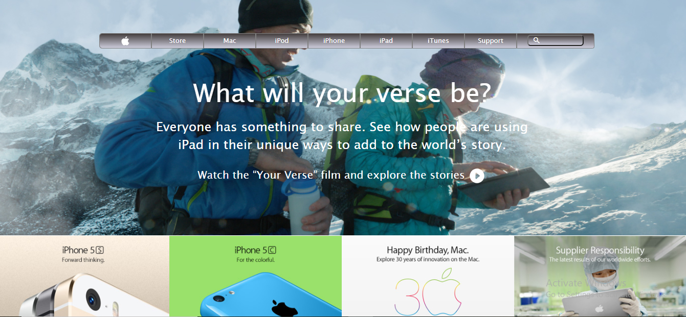

# Apple-Home-Page

### **Description:** 

Project based The Apple Home page, it shows a main section which contains Navbar with list choice and a footer section.
 	
 **Main section:**
 
 	- Navbar , data and  different URLs for further information.
 	- A Flex applied with Navbar list to make information more attractive.
 	
 **Footer section:**
 
 	- Defining about the different sections of information.
 	- Text related to legal information about the website.
 	
	
 ### **Tools used:**
 
 HTML5, and CSS3.
 
 
  [Live demo link](https://varun2323.github.io/NewYork-Times-Page/)
 
 
### **Getting Started:**

The Apple Home Page including a Main, and Footer sections.

 ### **Requirements:** 

 - OS: Windows, Linux, or Mac.
 - Browser: Google Chrome, Mozilla Firefox, Edge, etc.
 

### **Set up:**

You can download the code or clone the repository to your local system.

## **Author:**

👤 Varun Sharma

GitHub: [@Varun2323](https://github.com/Varun2323)

LinkedIn: [Varun Sharma](https://www.linkedin.com/in/varun-sharma-82b29b82/)

 
## **Show your support**

Spread the word if you like this project.

## **Acknowledgments**

Thanks to - [W3Schools](http://w3schools-fa.ir)

Thanks to - [stack overflow](https://stackoverflow.com/)
